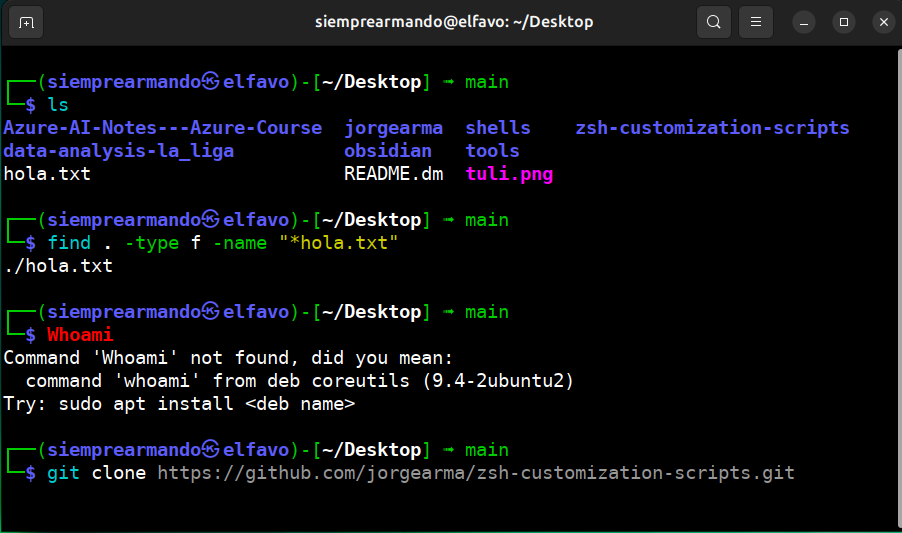

# Automatic Zsh Installation and Customization  

This script simplifies the installation and configuration of **Zsh** on **Linux** and **macOS** systems. It also includes **Oh My Zsh** along with several useful plugins to optimize the terminal experience.



## Requirements
- curl
- git
- Python 3
- Administrator access (sudo) on Linux
- Homebrew (if using macOS)

## Functionality

This script automates the installation and configuration of Zsh with the following features:

1. **Zsh Installation**: Verifies and installs Zsh depending on the operating system (Linux or macOS).  
2. **Oh My Zsh Setup**: Downloads and installs Oh My Zsh, a framework that makes shell customization easier.  
3. **Environment Customization**: Generates a `.zshrc` file with default settings, including enhancements for user experience.  
4. **Essential Plugin Installation**: Adds and configures the `zsh-autosuggestions` (auto-suggestions for commands) and `zsh-syntax-highlighting` (syntax highlighting) plugins.  
5. **Change Default Shell**: Sets Zsh as the default shell for the current user.  

With this setup, Zsh will provide a more productive and user-friendly environment, supporting advanced autocompletion and syntax highlighting.

## Usage

1. Clone this repository or download the file.
2. Run the script in your terminal:
    ```bash
    git clone https://github.com/jorgearma/zsh-customization-scripts.git
    
    cd zsh-customization-scripts
    ```
    ```bash
    python3 kali-shell-zsh.py
    ```

3. ⚠️ If you don't have Oh My Zsh installed, type `exit` in the terminal when it opens.
4. Restart your terminal and ensure you are using Zsh for the changes to take effect.

## Steps Performed by the Script

- **Zsh Installation**:
    - On Linux, it uses `apt` to install Zsh.
    - On macOS, it uses `Homebrew` (it will be installed automatically if not present).
  
- **Oh My Zsh Installation**: It installs from the official repository.

- **`.zshrc` Customization**: The `gnzh` theme is set, and the plugins `git`, `zsh-syntax-highlighting`, and `zsh-autosuggestions` are enabled.

- **Changing Default Shell**: Sets Zsh as the default shell, asking the user to restart the terminal.

## Common Issues

- If you don't have `Homebrew` on macOS, the script will install it automatically.
- If the change to Zsh shell doesn't apply, try manually running `chsh -s $(which zsh)`.

## License

This project is licensed under the **GNU General Public License (GPLv2 or later)**, the same license used by the Linux kernel.  

The file `./zshrc` comes from the Kali Linux distribution and is maintained under its original license. The automation and changes made to add version control with Git were done by me, but the base content remains from Kali Linux.  

For more information about the GPL, you can visit:  
[https://www.gnu.org/licenses/gpl-2.0.html](https://www.gnu.org/licenses/gpl-2.0.html)  